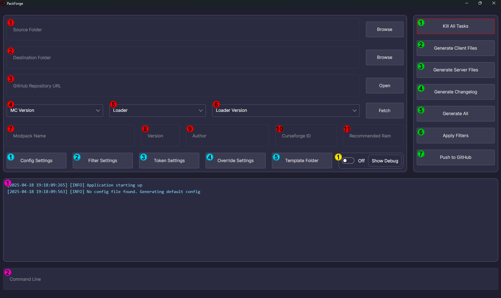
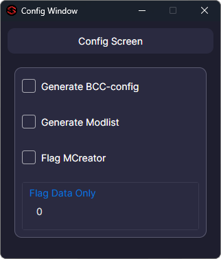

# What is PackForge?

PackForge is a tool to simplify the process of creating Minecraft modpacks. It allows you to easily generate a set of
client and server files without much hassle. It is designed to be used with the [CurseForge](https://www.curseforge.com/)
since it makes use of the curseforge format. Other formats are currently not supported.

---

# Features

- Create a set of client & server files from CurseForge instance folder
- Automatically download files from GitHub to keep configs and scripts up to date
- Automatically grab the selected (neo)forge version from maven (fabric is not planned to be supported)
- Lets you filter mods based on the following filter:
    - Delete excluded mods
    - Delete excluded mods on the server side only (useful for removing client only mods)
    - Delete excluded mods on the client side only
    - Delete excluded mods by certain authors
    - Flag a mod if they contain Mcreator fragments
    - Flag a mod if they contain less than x class files (useful for flagging data packs disguised as mods)
- Generate a nicely formatted changelog based on two KubeJs exports
- Generate a set of configs for the following mods:
    - [Better Compatibility Checker](https://www.curseforge.com/minecraft/mc-mods/better-compatibility-checker) 
    - [Crash Assistant](https://www.curseforge.com/minecraft/mc-mods/crash-assistant)
- Automatically push the generated files back to a GitHub repository

---

# Interface

When you open PackForge for the very first time, you will be greeted by something like this:

---

## Red Section

1. **Source Folder**: The source folder is the folder where your CurseForge instance is located. 
From this instance, PackForge will generate the final results.
2. **Destination Folder**: The output folder is the folder where PackForge will generate the final results. 
Added to this selected folder will be `<Selection>/<ModpackName>/<ModpackVersion>/` to keep a clean structure.
3. **GitHub Repository Url**: This is the URL of your repo where you should store all the necessary files.
An example structure can be found [here](https://github.com/AllTheMods/ATM-10). If your repository is private you 
need to also have entered a token in the settings!
4. **Minecraft Version**: The Minecraft version of the modpack. Used for grabbing the correct (neo)forge version and
to generate the CurseForge manifest.
5. **Loader**: Which loader to use for the modpack. Options are Neoforge and Forge, other loaders are not planned.
6. **Loader Version**: Pressing the Fetch button will attempt to fetch all possible loader versions from the maven.
7. **Modpack Name**: The name of the modpack. This will be used for the folder structure and the manifest.
8. **Modpack Version**: The version of the modpack. Used in the manifest and various file generation.
9. **Author**: The author of the modpack. Used in the manifest.
10. **CurseForge ID**: This can be used to generate the BCC config, leave it blank if you don't plan on using it.
11. **Recommended Ram**: The recommended ram for the modpack. Used in the manifest.

---

## Blue Section

### 1. Config Settings 

- **Generate BCC-Config**: This will automatically generate a config for the Better Compatibility Checker mod.
- **Generate Modlist**: This will automatically generate a modlist config for the Crash Assistant mod.
- **Flag Mcreator Mods**: This will flag all mods that contain Mcreator fragments when applying filters
- **Flag Data Only**: This will flag all mods that contain less than x class files when applying filters

### 2. Filter Settings

Filters work based on the Mod Id. Authors will ignore case when matching.
- **Exclude Mods**: This will remove all mods mentioned here from the final output.
- **Exclude Mods on Server**: This will remove all mods mentioned here from the server files.
- **Exclude Mods on Client**: This will remove all mods mentioned here from the client files.
- **Exclude Authors**: This will remove all mods from the authors mentioned here.

### 3. Token Settings

- **GitHub Token**: This is the token used to make commits for the user, such as pushing the generated files to the repo.
This is also required if you're working with a private repository.

### 4. Overwrite Settings

- **Client Override Folder**: This will updated the given folder with the files from github during generation.
- **Server Override Folder**: This will updated the given folder with the files from github during generation.

### 5. Template Folder

Files placed in here will be added to the **Server Files** during generation. This is useful for adding files such as 
Server starters or readme files

---

## Yellow Section

1. Toggling this will show debug output in the console

---

## Green Section

1. **Kill All Tasks**: This will stop all currently running processes

2. **Generate Client Files**: This will start the generation of the client files.
   - Copy the files from the source folder to the destination folder
   - Grab the files from github and copy them to the destination folder
   - Generate the configs
   - Apply the filter to the destination folder
   - Generate the manifest file
   - Clean up
   - Zip the files
   
3. **Generate Server Files**: This will start the generation of the server files.
   - Copy the files from the source folder to the destination folder
   - Grab the files from github and copy them to the destination folder
   - Generate the configs
   - Apply the filter to the destination folder
   - Download the server jar from mave
   - Copy the template files to the destination folder
   - Clean up
   - Zip the files
   
4. **Generate Changelog**: This will generate a changelog based on the two KubeJs exports.
   - The old export should already be present
   - The new export will be copied from the source folder
   - The changelog will be generated in the destination folder
   
5. **Generate All**: Runs the three previous steps in order. 
   - Generate Client Files
   - Generate Server Files
   - Generate Changelog

6. **Apply Filters**: This will apply the given filters to the source folder

7. **Push to GitHub**: This will push the generated configs to the GitHub repository.

---

## Pink Section

1. **Logs**: This will show all logs, the saved logs can be found at `%APPDATA%/PackForge/logs/`

2. **Command Line**: This can be used to enter commands, currently available are the following:

### Commands

#### Changelog Commands

- `changelog init <path> <name>`: Will initialize the very first export from the given path. This should only be needed once
- `changelog generate normal <dest> <source> <name> <version>`: Will generate a normal changelog from the given source and at the destination
- `changelog generate versioned <dest> <oldVersion> <version>`: Will generate a changelog from two given versions at the given destination if those exports exist

#### Git Commands

- `git open`: Opens the repository appdata location
- `git status`: Displays the current status of the repository
- `git clone <url>`: Clones the given repository to the appdata folder
- `git pull <url>`: Pulls the latest changes from the given repository
- `git stage <path>`: Adds the given path to the staging area
- `git commit <message>`: Commits the current changes with the given message
- `git push <url>`: Pushes the current changes to the given repository

---